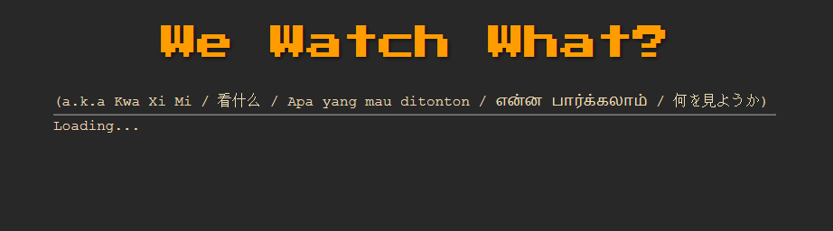
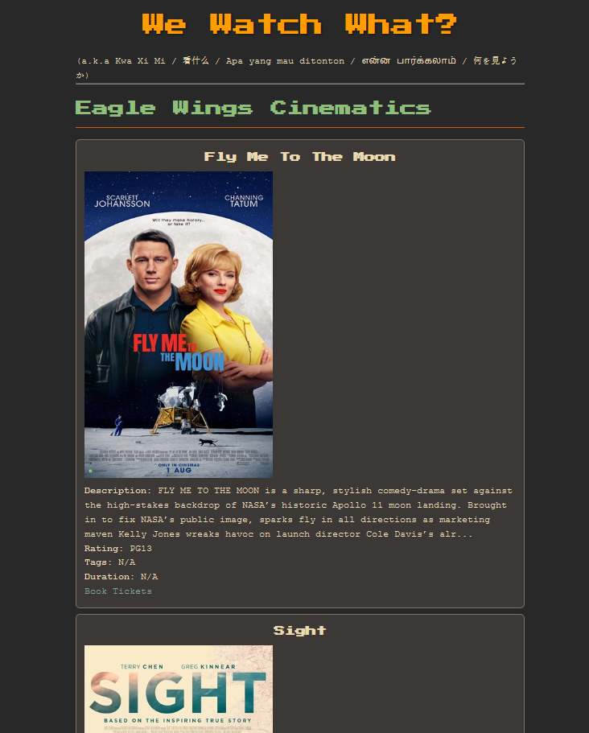
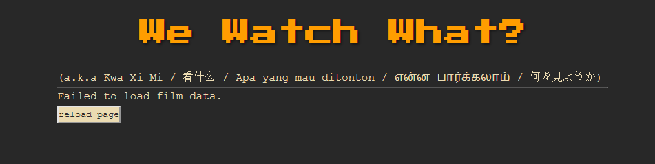

> [!NOTE]  
> W3's website is under active  
> development right now.  
>  
> Support for data scraped from other  
> cinemas and streaming platforms  
> might come in the far future.  
>  
> *\- Gabriel*  


# `We Watch What`

Search engine for movies showing in your area.  


## Screenshots





## Coverage
  
W3 collates films by scraping webpages for the below cinemas.  
  
| Site | Implementation log |
| :--- | :--- |
| [Golden Village](https://www.gv.com.sg/) | :white_check_mark: |
| [Eagle Wings Cinematics](https://www.eaglewingscinematics.com.sg/) | :white_check_mark: |
| [The Projector](https://theprojector.sg/) | :white_check_mark: |
| [Filmgarde Cineplexes](https://fgcineplex.com.sg/movies) | :white_check_mark: |
| [WE Cinemas](https://www.wecinemas.com.sg/) | :white_check_mark: |
| [Shaw Theatres](https://shaw.sg/) | :construction: |
| [Cathay Cineplexes](https://www.cathaycineplexes.com.sg/) | :x: |
  
## Features

These are the features that W3 provides to distinguish itself from other products in the market.

* `WeWatchWhat` website
    * Single unified platform that aggregates all movies showing on the current day from multiple cinemas.
    * Shows all essential details about a film at a glance.
* Web access  
    * No mobile app required to search for movies.
    * W3 is a web application, meaning no installation is required and it can run on any device that has a browser. 
* API for public use
    * Exposes an easy-to-use REST API for [these cinemas](#coverage).
    * API documentation available [here](#api-usage).

## Development
  
To work with W3, you can optionally

* run the W3 server [locally](#local-server) at `localhost:3000`
* run the [`Makefile`](#install-via-makefile) to automatically install dependancies  
* do dependancy installation [yourself](#do-it-yourself)  
  
### Local server
  
```console
$ node server.js
```
  
### Install via Makefile  
  
```console
$ make build
$ cd lib
$ node <cinemaName>.js
```
  
### Do it yourself  
  
1. Install [NVM](https://github.com/nvm-sh/nvm), [npm](https://www.npmjs.com/) and [Node.js](https://nodejs.org/en).  
2. Install [playwright](https://playwright.dev/) as a dependancy.  
3. Run the JavaScript file with the filepath `./lib/<cinemaName>.js` where `<cinemaName>` is one of the following.  
    * weCinemas  
    * theProjector  
    * shawTheatres  
    * goldenVillage  
    * filmgardeCineplexes  
    * eagleWingsCinematics  
  
## Contribute

W3 is open-source. Feel free to [open a pull request](https://docs.github.com/en/pull-requests/collaborating-with-pull-requests/proposing-changes-to-your-work-with-pull-requests/creating-a-pull-request) and contribute. Below are features that W3 aims to implement in the future. 

* Bookmarking
    * Films can be bookmarked for later reference.
    * Custom filters can also be bookmarked and stored in query params.  
* Filtering
    * Filters movies based on rating, duration, cinema location, languages and theme.
* ***We watch what*** button
    * Button that randomly chooses a movie to watch.

## API Usage
  
* Each film object comprises of the below attributes.
    * `title`: movie title
    * `tags`: genre, categories, themes
    * `description`: blurb, languages
    * `duration`: in minutes
    * `rating`: age guidelines
    * `bookTicketsUrl`: ticket booking url
    * `posterSrc`: img source url
* Each attribute is of the [*String*](https://developer.mozilla.org/en-US/docs/Web/JavaScript/Reference/Global_Objects/String) datatype.
* Attributes that were not found are assigned the [*null*](https://developer.mozilla.org/en-US/docs/Web/JavaScript/Reference/Operators/null) value.

```json
{
    title: null
    tags: null,
    description: null,
    duration: null
    rating: null,
    bookTicketsUrl: null,
    posterSrc: null
}
```